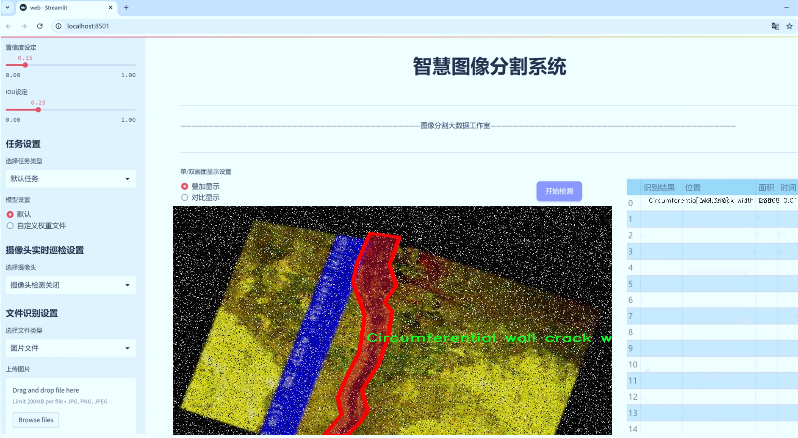
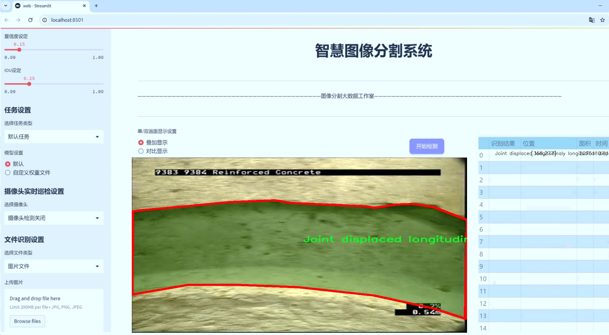
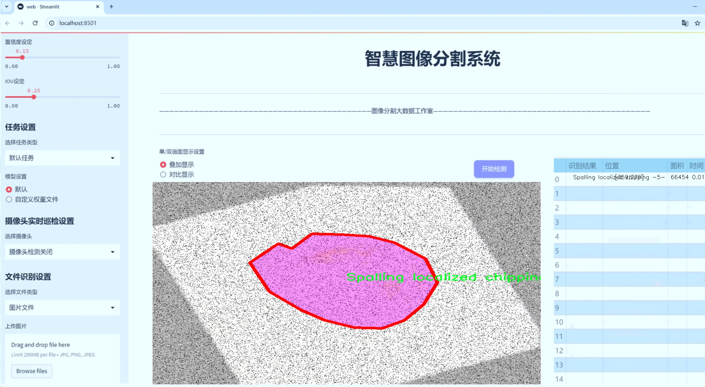
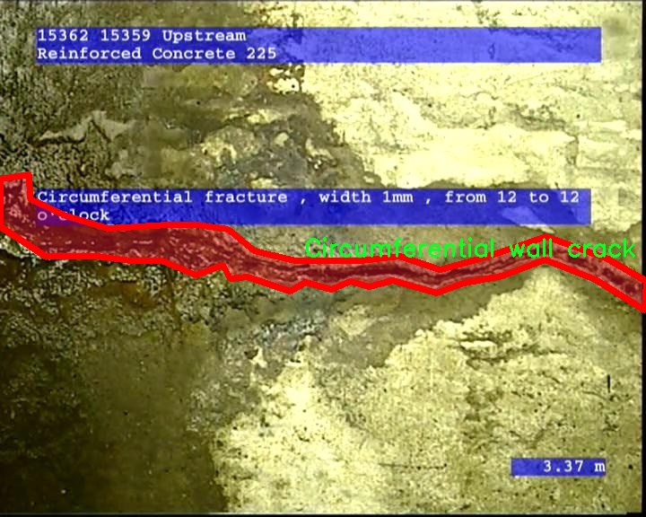
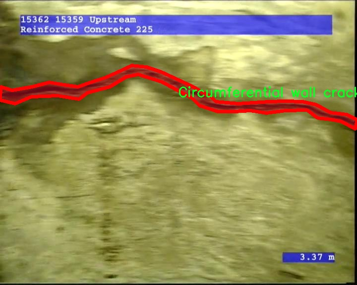
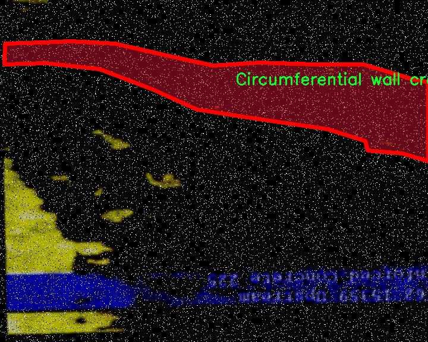
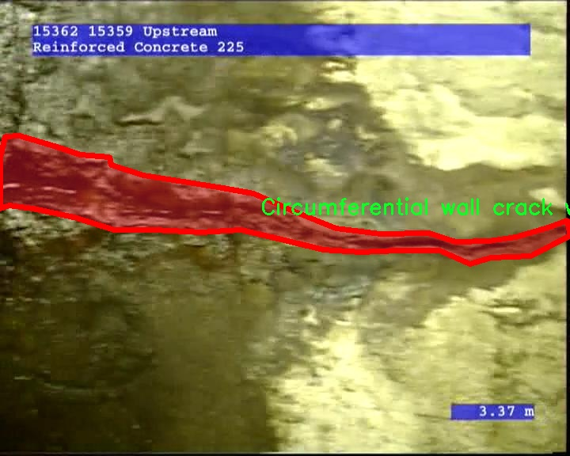
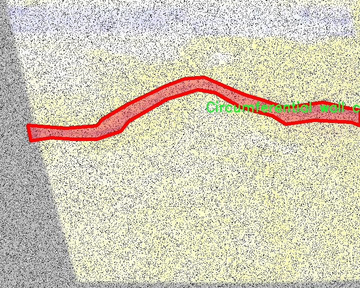

# 管道缺陷图像分割系统源码＆数据集分享
 [yolov8-seg-C2f-CloAtt＆yolov8-seg-slimneck等50+全套改进创新点发刊_一键训练教程_Web前端展示]

### 1.研究背景与意义

项目参考[ILSVRC ImageNet Large Scale Visual Recognition Challenge](https://gitee.com/YOLOv8_YOLOv11_Segmentation_Studio/projects)

项目来源[AAAI Global Al lnnovation Contest](https://kdocs.cn/l/cszuIiCKVNis)

研究背景与意义

随着城市化进程的加快，地下管道的建设与维护显得尤为重要。管道作为城市基础设施的重要组成部分，承担着供水、排水、供气等多重功能。然而，随着时间的推移，管道在使用过程中不可避免地会出现各种缺陷，如裂缝、腐蚀、位移等，这些缺陷不仅影响管道的正常运行，还可能导致严重的安全隐患。因此，及时、准确地检测和评估管道缺陷，成为保障城市安全与可持续发展的重要任务。

传统的管道缺陷检测方法主要依赖人工检查和经验判断，这种方法不仅效率低下，而且容易受到人为因素的影响，导致漏检或误判。近年来，随着计算机视觉和深度学习技术的快速发展，基于图像处理的自动化检测方法逐渐成为研究热点。YOLO（You Only Look Once）系列模型以其高效的实时目标检测能力，在多个领域取得了显著的成果。然而，现有的YOLO模型在处理复杂的管道缺陷图像时，仍然面临着精度不足和分割能力有限的问题。因此，改进YOLOv8模型以实现更高效的管道缺陷图像分割，具有重要的理论价值和实际意义。

本研究基于CCTV缺陷检测数据集，包含1100幅图像和19类缺陷信息，涵盖了从微小裂缝到明显腐蚀等多种管道缺陷类型。这一数据集的丰富性为模型的训练和评估提供了良好的基础。通过对这些图像进行实例分割，不仅可以精确定位缺陷的位置，还能对缺陷的类型和严重程度进行分类，从而为后续的管道维护和修复提供科学依据。尤其是在管道裂缝、腐蚀和位移等问题日益严重的背景下，基于改进YOLOv8的管道缺陷图像分割系统，将为管道的智能检测和维护提供新的解决方案。

此外，随着智能城市和物联网技术的发展，管道监测的自动化和智能化已成为未来的发展趋势。基于深度学习的图像分割技术，能够实现对管道状态的实时监测和预警，提升管道管理的效率和安全性。通过对管道缺陷进行准确的识别和分类，相关部门可以更好地制定维护计划，优化资源配置，降低维护成本，最终实现管道的安全运行和延长使用寿命。

综上所述，基于改进YOLOv8的管道缺陷图像分割系统的研究，不仅填补了现有技术在管道缺陷检测领域的空白，还为城市基础设施的智能化管理提供了新的思路和方法。通过本研究的深入，期望能够推动管道检测技术的进步，为城市的可持续发展贡献力量。

### 2.图片演示







##### 注意：由于此博客编辑较早，上面“2.图片演示”和“3.视频演示”展示的系统图片或者视频可能为老版本，新版本在老版本的基础上升级如下：（实际效果以升级的新版本为准）

  （1）适配了YOLOV8的“目标检测”模型和“实例分割”模型，通过加载相应的权重（.pt）文件即可自适应加载模型。

  （2）支持“图片识别”、“视频识别”、“摄像头实时识别”三种识别模式。

  （3）支持“图片识别”、“视频识别”、“摄像头实时识别”三种识别结果保存导出，解决手动导出（容易卡顿出现爆内存）存在的问题，识别完自动保存结果并导出到tempDir中。

  （4）支持Web前端系统中的标题、背景图等自定义修改，后面提供修改教程。

  另外本项目提供训练的数据集和训练教程,暂不提供权重文件（best.pt）,需要您按照教程进行训练后实现图片演示和Web前端界面演示的效果。

### 3.视频演示

[3.1 视频演示](https://www.bilibili.com/video/BV1QoyaYFE86/)

### 4.数据集信息展示

##### 4.1 本项目数据集详细数据（类别数＆类别名）

nc: 19
names: ['Breaking', 'Circumferential fracture width 1mm', 'Circumferential fracture width 2mm', 'Circumferential fracture width 3mm', 'Circumferential wall crack width 1mm', 'Circumferential wall crack width 2mm', 'Circumferential wall crack width 3mm', 'Conduit wall has become roughened', 'Hole in wall', 'Joint displaced longitudinaly longitudinal displacement -30mm', 'Joint displaced longitudinaly longitudinal displacement 21 -30mm', 'Joint radial displacement 5-10mm', 'Jointradial displacement 11-20mm', 'Longitudinal surface crack at joint width 1mm', 'Reinforcement is exposed and corroded', 'Soil visible through defect', 'Some coarse aggregate is visable', 'Spalling localized chipping -5-', 'Void visible through defect']


##### 4.2 本项目数据集信息介绍

数据集信息展示

在现代管道检测和维护领域，图像分割技术的应用日益广泛，尤其是在缺陷检测方面。为此，我们构建了一个名为“CCTV Defect Detection Data”的数据集，旨在为改进YOLOv8-seg的管道缺陷图像分割系统提供丰富的训练数据。该数据集包含19个类别，涵盖了各种管道缺陷的具体类型，确保了对不同缺陷特征的全面捕捉和分析。

首先，数据集中包括的类别如“Breaking”代表了管道的断裂情况，这种缺陷通常会导致严重的安全隐患。接下来是不同宽度的环形裂缝，例如“Circumferential fracture width 1mm”、“Circumferential fracture width 2mm”和“Circumferential fracture width 3mm”，这些裂缝的宽度变化为模型提供了重要的特征信息，帮助其识别裂缝的严重程度和潜在的影响。此外，环形壁裂缝的类别也被细分为不同宽度，进一步丰富了数据集的多样性。

数据集中还包含了“Conduit wall has become roughened”这一类别，反映了管道壁面粗糙化的情况，这可能是由于长期的腐蚀或磨损所致。另一个重要的类别是“Hole in wall”，它直接指向管道的穿孔缺陷，这种缺陷的存在可能导致流体泄漏，影响管道的正常运行。针对接头的位移，数据集提供了“Joint displaced longitudinaly longitudinal displacement -30mm”和“Joint displaced longitudinaly longitudinal displacement 21 -30mm”两个类别，涵盖了不同方向和程度的位移情况，这对于检测管道连接处的稳定性至关重要。

此外，数据集中还包含了“Joint radial displacement 5-10mm”和“Jointradial displacement 11-20mm”两个类别，专注于接头的径向位移，帮助模型识别管道在不同压力和负载下的变形情况。针对接头处的表面裂缝，数据集提供了“Longitudinal surface crack at joint width 1mm”这一类别，确保模型能够检测到接头的微小缺陷。

在管道的腐蚀检测方面，“Reinforcement is exposed and corroded”类别为模型提供了重要的训练样本，帮助其识别由于腐蚀导致的钢筋暴露现象。数据集还包括“Soil visible through defect”和“Some coarse aggregate is visible”这两个类别，分别反映了管道缺陷导致的土壤或粗骨料的可见性，这些信息对于评估管道的整体结构完整性至关重要。

最后，数据集中还包含了“Spalling localized chipping -5-”和“Void visible through defect”两个类别，前者指向局部剥落和缺损，后者则强调了通过缺陷可见的空洞，这些都是管道维护中需要重点关注的缺陷类型。

综上所述，“CCTV Defect Detection Data”数据集通过细致的类别划分和丰富的缺陷特征，为改进YOLOv8-seg的管道缺陷图像分割系统提供了坚实的基础。通过对这些数据的深入学习和分析，模型将能够更准确地识别和分类管道中的各种缺陷，从而提升管道检测的效率和准确性，为管道的安全运行提供有力保障。











### 5.全套项目环境部署视频教程（零基础手把手教学）

[5.1 环境部署教程链接（零基础手把手教学）](https://www.bilibili.com/video/BV1jG4Ve4E9t/?vd_source=bc9aec86d164b67a7004b996143742dc)


[5.2 安装Python虚拟环境创建和依赖库安装视频教程链接（零基础手把手教学）](https://www.bilibili.com/video/BV1nA4VeYEze/?vd_source=bc9aec86d164b67a7004b996143742dc)

### 6.手把手YOLOV8-seg训练视频教程（零基础小白有手就能学会）

[6.1 手把手YOLOV8-seg训练视频教程（零基础小白有手就能学会）](https://www.bilibili.com/video/BV1cA4VeYETe/?vd_source=bc9aec86d164b67a7004b996143742dc)


按照上面的训练视频教程链接加载项目提供的数据集，运行train.py即可开始训练



     Epoch   gpu_mem       box       obj       cls    labels  img_size
     1/200     0G   0.01576   0.01955  0.007536        22      1280: 100%|██████████| 849/849 [14:42<00:00,  1.04s/it]
               Class     Images     Labels          P          R     mAP@.5 mAP@.5:.95: 100%|██████████| 213/213 [01:14<00:00,  2.87it/s]
                 all       3395      17314      0.994      0.957      0.0957      0.0843

     Epoch   gpu_mem       box       obj       cls    labels  img_size
     2/200     0G   0.01578   0.01923  0.007006        22      1280: 100%|██████████| 849/849 [14:44<00:00,  1.04s/it]
               Class     Images     Labels          P          R     mAP@.5 mAP@.5:.95: 100%|██████████| 213/213 [01:12<00:00,  2.95it/s]
                 all       3395      17314      0.996      0.956      0.0957      0.0845

     Epoch   gpu_mem       box       obj       cls    labels  img_size
     3/200     0G   0.01561    0.0191  0.006895        27      1280: 100%|██████████| 849/849 [10:56<00:00,  1.29it/s]
               Class     Images     Labels          P          R     mAP@.5 mAP@.5:.95: 100%|███████   | 187/213 [00:52<00:00,  4.04it/s]
                 all       3395      17314      0.996      0.957      0.0957      0.0845


### 7.50+种全套YOLOV8-seg创新点代码加载调参视频教程（一键加载写好的改进模型的配置文件）

[7.1 50+种全套YOLOV8-seg创新点代码加载调参视频教程（一键加载写好的改进模型的配置文件）](https://www.bilibili.com/video/BV1Hw4VePEXv/?vd_source=bc9aec86d164b67a7004b996143742dc)

### 8.YOLOV8-seg图像分割算法原理

原始YOLOv8-seg算法原理

YOLOv8-seg算法是YOLO系列中的最新版本，继承并发展了YOLOv5和YOLOv7的优良特性。该算法的设计旨在提高目标检测和分割的精度与速度，特别是在复杂场景下的应用能力。YOLOv8-seg不仅仅是一个目标检测算法，更是一个集成了目标分割功能的高效模型，能够在实时应用中提供高质量的分割结果。

YOLOv8-seg的架构依然遵循YOLO系列的基本设计理念，采用了输入层、主干网络、特征融合层和解耦头的结构。与之前的版本相比，YOLOv8-seg在网络深度和复杂度上进行了显著的提升，特别是在主干网络部分，使用了C2f模块来替代YOLOv5中的C3模块。C2f模块的设计灵感来源于ELAN结构，增加了多个残差连接，使得模型在保持轻量化的同时，能够有效地捕捉更多的梯度信息。这种设计不仅增强了特征的重用能力，还缓解了深层网络中的梯度消失问题，从而提升了模型的整体性能。

在特征融合方面，YOLOv8-seg采用了PAN-FPN结构，这种结构能够有效地整合来自不同层次的特征信息，确保在进行目标检测和分割时，能够充分利用低层特征的细节信息和高层特征的语义信息。具体来说，YOLOv8-seg通过自下而上的方式融合高层特征与中层特征，并通过横向连接将融合后的特征传递到解耦头部分。这种特征融合策略使得模型在面对不同尺度和不同类型的目标时，能够保持较高的检测精度。

YOLOv8-seg在损失函数的设计上也进行了创新，采用了VFLLoss作为分类损失，同时结合DFLLoss和CIoULoss作为回归损失。这种组合损失函数能够有效地解决目标检测中的样本不平衡问题，尤其是在小目标检测和复杂背景下的目标分割任务中，能够显著提升模型的鲁棒性和准确性。

在数据预处理方面，YOLOv8-seg延续了YOLOv5的策略，采用了多种数据增强技术，如马赛克增强、混合增强、空间扰动和颜色扰动等。这些增强手段不仅丰富了训练数据的多样性，还提高了模型的泛化能力，使得YOLOv8-seg在实际应用中能够更好地适应不同的场景和条件。

YOLOv8-seg的解耦头结构是其另一大亮点。与传统的Anchor-Based方法不同，YOLOv8-seg采用了Anchor-Free的思想，解耦了分类和回归任务。这种设计使得模型在进行目标检测时，能够更加灵活地处理不同类型的目标，尤其是在目标密集的场景中，能够有效减少误检和漏检的情况。

总的来说，YOLOv8-seg算法通过深度优化网络结构、改进特征融合策略、创新损失函数设计以及引入先进的数据增强技术，极大地提升了目标检测和分割的性能。其在智能监控、自动驾驶和人脸识别等领域的广泛应用，展示了其强大的实用性和适应性。通过对YOLOv8-seg的深入研究与应用，可以为未来的目标检测和分割技术的发展提供新的思路和方向。


### 9.系统功能展示（检测对象为举例，实际内容以本项目数据集为准）

图9.1.系统支持检测结果表格显示

  图9.2.系统支持置信度和IOU阈值手动调节

  图9.3.系统支持自定义加载权重文件best.pt(需要你通过步骤5中训练获得)

  图9.4.系统支持摄像头实时识别

  图9.5.系统支持图片识别

  图9.6.系统支持视频识别

  图9.7.系统支持识别结果文件自动保存

  图9.8.系统支持Excel导出检测结果数据


### 10.50+种全套YOLOV8-seg创新点原理讲解（非科班也可以轻松写刊发刊，V11版本正在科研待更新）

#### 10.1 由于篇幅限制，每个创新点的具体原理讲解就不一一展开，具体见下列网址中的创新点对应子项目的技术原理博客网址【Blog】：


[10.1 50+种全套YOLOV8-seg创新点原理讲解链接](https://gitee.com/qunmasj/good)

#### 10.2 部分改进模块原理讲解(完整的改进原理见上图和技术博客链接)【如果此小节的图加载失败可以通过CSDN或者Github搜索该博客的标题访问原始博客，原始博客图片显示正常】
### 全维动态卷积ODConv
鉴于上述讨论，我们的ODConv引入了一种多维注意机制，该机制具有并行策略，用于学习卷积核在核空间的所有四个维度上的不同注意。图提供了CondConv、DyConv和ODConv的示意性比较。

ODConv的公式：根据等式1中的符号，ODConv可定义为


 将注意力标量分配给整个卷积核。图2示出了将这四种类型的关注乘以n个卷积核的过程。原则上，这四种类型的关注是相互补充的，并且以位置、信道、滤波器和核的顺序将它们逐步乘以卷积核 
 ，使得卷积运算不同w.r.t.所有空间位置、所有输入信道、所有滤波器和输入x的所有核，提供捕获丰富上下文线索的性能保证。因此，ODConv可以显著增强CNN基本卷积运算的特征提取能力。此外，具有单个卷积核的ODConv可以与标准CondConv和DyConv竞争或优于它们，为最终模型引入的额外参数大大减少。提供了大量实验来验证这些优点。通过比较等式1和等式2，我们可以清楚地看到，ODConv是一种更广义的动态卷积。此外，当设置n=1且 所有分量均为1时，只关注滤波器方向 的ODConv将减少为：将基于输入特征的SE变量应用于卷积滤波器，然后进行卷积运算（注意原始SE（Hu等人，2018b）基于输出特征，并且用于重新校准输出特征本身）。这种SE变体是ODConv的特例。


图：将ODConv中的四种注意类型逐步乘以卷积核的示例。（a） 沿空间维度的逐位置乘法运算，（b）沿输入信道维度的逐信道乘法运算、（c）沿输出信道维度的按滤波器乘法运算，以及（d）沿卷积核空间的核维度的按核乘法运算。方法部分对符号进行了说明
实现：对于ODConv，一个关键问题是如何计算卷积核的四种关注度 。继CondConv和DyConv之后，我们还使用SE型注意力模块（Hu等人，2018b），但将多个头部作为来计算它们，其结构如图所示。具体而言，首先通过逐通道全局平均池（GAP）运算将输入压缩到具有长度的特征向量中。随后，存在完全连接（FC）层和四个头部分支。ReLU（Krizhevsky等人，2012）位于FC层之后。FC层将压缩特征向量映射到具有缩减比的低维空间（根据消融实验，我们在所有主要实验中设置 ，避免了高模型复杂度）。对于四个头部分支，每个分支都有一个输出大小如图。

### 引入ODConv的改进YOLO
参考这篇博客涵盖了引入ODConv的改进YOLOv8系统的内容，ODConv采用多维注意机制，在卷积核空间的四个维度上学习不同的注意。结合了CondConv和DyConv的优势，ODConv通过图示的四种注意类型逐步与卷积核相乘，以捕获丰富的上下文线索，提升特征提取能力。

#### ODConv结构与方法
ODConv的公式和图示展示了其关注力分配给卷积核的方式，其中四种类型的关注以位置、信道、滤波器和核的顺序逐步与卷积核相乘。这种结构保证了卷积运算不同于标准的Conv操作，能够捕获更多上下文信息，从而增强了CNN的特征提取能力。另外，单个卷积核的ODConv在性能上能够与CondConv和DyConv相竞争，并且引入的额外参数大幅减少。

ODConv的特殊之处在于其广义的动态卷积性质，同时在特定条件下（n=1且所有分量为1），它可以退化为一种特例，即只关注滤波器方向，这类似于基于输入特征的SE变体，但不同于原始SE，它基于输出特征。

#### ODConv的实现
关键问题在于如何计算卷积核的四种关注度。ODConv采用了SE型注意力模块，结合了多个头部来计算这些关注度。具体实现上，通过逐通道全局平均池运算和完全连接层，将输入压缩为特征向量，随后使用四个头部分支来计算四种不同类型的关注。这样的结构能在保持模型复杂度可控的情况下，提升了特征的表征能力。

ODConv的引入为YOLOv8带来了显著的性能提升，并且通过大量实验证明了其在特征提取方面的优越性。其结合了多维注意机制和卷积操作，为目标检测和分拣系统的提升带来了新的思路和性能突破。


### 11.项目核心源码讲解（再也不用担心看不懂代码逻辑）

#### 11.1 ui.py

以下是对给定代码的核心部分进行提炼和详细注释的版本：

```python
import sys
import subprocess

def run_script(script_path):
    """
    使用当前 Python 环境运行指定的脚本。

    Args:
        script_path (str): 要运行的脚本路径

    Returns:
        None
    """
    # 获取当前 Python 解释器的路径
    python_path = sys.executable

    # 构建运行命令，使用 streamlit 运行指定的脚本
    command = f'"{python_path}" -m streamlit run "{script_path}"'

    # 执行命令并等待其完成
    result = subprocess.run(command, shell=True)
    
    # 检查命令执行结果，如果返回码不为0，表示出错
    if result.returncode != 0:
        print("脚本运行出错。")

# 主程序入口
if __name__ == "__main__":
    # 指定要运行的脚本路径
    script_path = "web.py"  # 假设脚本在当前目录下

    # 调用函数运行脚本
    run_script(script_path)
```

### 代码核心部分分析与注释：

1. **导入模块**：
   - `import sys`: 导入 `sys` 模块以获取 Python 解释器的路径。
   - `import subprocess`: 导入 `subprocess` 模块以执行外部命令。

2. **`run_script` 函数**：
   - 该函数接受一个参数 `script_path`，表示要运行的 Python 脚本的路径。
   - 使用 `sys.executable` 获取当前 Python 解释器的路径。
   - 构建一个命令字符串，使用 `streamlit` 运行指定的脚本。
   - 使用 `subprocess.run` 执行命令，并等待其完成。
   - 检查命令的返回码，如果不为0，打印错误信息。

3. **主程序入口**：
   - 使用 `if __name__ == "__main__":` 确保该代码块仅在直接运行该脚本时执行。
   - 指定要运行的脚本路径（在这里假设为 `web.py`）。
   - 调用 `run_script` 函数以执行指定的脚本。

通过这些注释，代码的功能和每个部分的作用变得更加清晰。

这个程序文件 `ui.py` 的主要功能是运行一个指定的 Python 脚本，具体来说是使用 Streamlit 框架来启动一个 Web 应用。程序的结构相对简单，主要由几个部分组成。

首先，文件导入了一些必要的模块，包括 `sys`、`os` 和 `subprocess`。其中，`sys` 模块用于访问与 Python 解释器相关的变量和函数，`os` 模块提供了与操作系统交互的功能，而 `subprocess` 模块则用于执行外部命令。

接下来，程序定义了一个名为 `run_script` 的函数，该函数接受一个参数 `script_path`，表示要运行的脚本的路径。在函数内部，首先通过 `sys.executable` 获取当前 Python 解释器的路径，这样可以确保在正确的环境中运行脚本。然后，构建一个命令字符串，该命令使用 Streamlit 运行指定的脚本。命令的格式是 `"{python_path}" -m streamlit run "{script_path}"`，其中 `{python_path}` 和 `{script_path}` 会被实际的路径替换。

之后，使用 `subprocess.run` 函数执行构建好的命令。这个函数会在新的子进程中运行命令，并等待其完成。如果命令执行的返回码不为 0，表示脚本运行出错，程序会打印出错误信息。

最后，在 `if __name__ == "__main__":` 语句块中，程序指定了要运行的脚本路径，这里使用了 `abs_path("web.py")` 来获取 `web.py` 的绝对路径。然后调用 `run_script` 函数来执行这个脚本。

总体来说，这个文件的功能是启动一个 Streamlit Web 应用，提供了一种简单的方式来运行 Python 脚本，并且在执行过程中处理了一些基本的错误检查。

#### 11.2 ultralytics\utils\callbacks\wb.py

以下是代码中最核心的部分，并附上详细的中文注释：

```python
# 导入必要的库
from ultralytics.utils import SETTINGS, TESTS_RUNNING
from ultralytics.utils.torch_utils import model_info_for_loggers

try:
    # 确保当前不是在测试模式下
    assert not TESTS_RUNNING  
    # 确保WandB集成已启用
    assert SETTINGS['wandb'] is True  
    import wandb as wb  # 导入WandB库

    # 确保WandB库正确安装
    assert hasattr(wb, '__version__')  

    import numpy as np  # 导入NumPy库
    import pandas as pd  # 导入Pandas库

    _processed_plots = {}  # 用于记录已处理的图表

except (ImportError, AssertionError):
    wb = None  # 如果导入失败或断言失败，则将wb设置为None


def _custom_table(x, y, classes, title='Precision Recall Curve', x_title='Recall', y_title='Precision'):
    """
    创建并记录自定义指标可视化到wandb.plot.pr_curve。

    该函数创建一个自定义指标可视化，模仿WandB默认的精确度-召回曲线行为，同时允许增强的自定义。
    该可视化指标对于监控模型在不同类别上的性能非常有用。

    参数:
        x (List): x轴的值；期望长度为N。
        y (List): y轴的对应值；也期望长度为N。
        classes (List): 标识每个点类别的标签；长度为N。
        title (str, optional): 图表的标题；默认为'Precision Recall Curve'。
        x_title (str, optional): x轴的标签；默认为'Recall'。
        y_title (str, optional): y轴的标签；默认为'Precision'。

    返回:
        (wandb.Object): 适合记录的wandb对象，展示了自定义的指标可视化。
    """
    # 创建一个数据框架
    df = pd.DataFrame({'class': classes, 'y': y, 'x': x}).round(3)
    fields = {'x': 'x', 'y': 'y', 'class': 'class'}
    string_fields = {'title': title, 'x-axis-title': x_title, 'y-axis-title': y_title}
    # 返回WandB表格对象
    return wb.plot_table('wandb/area-under-curve/v0',
                         wb.Table(dataframe=df),
                         fields=fields,
                         string_fields=string_fields)


def _plot_curve(x, y, names=None, id='precision-recall', title='Precision Recall Curve', x_title='Recall', y_title='Precision', num_x=100, only_mean=False):
    """
    记录指标曲线可视化。

    该函数根据输入数据生成指标曲线，并将可视化记录到WandB。
    曲线可以表示聚合数据（均值）或单个类别数据，具体取决于'only_mean'标志。

    参数:
        x (np.ndarray): x轴的数据点，长度为N。
        y (np.ndarray): y轴的对应数据点，形状为CxN，其中C表示类别数量。
        names (list, optional): 与y轴数据对应的类别名称；长度为C。默认为空列表。
        id (str, optional): 在WandB中记录数据的唯一标识符。默认为'precision-recall'。
        title (str, optional): 可视化图表的标题。默认为'Precision Recall Curve'。
        x_title (str, optional): x轴的标签。默认为'Recall'。
        y_title (str, optional): y轴的标签。默认为'Precision'。
        num_x (int, optional): 可视化的插值数据点数量。默认为100。
        only_mean (bool, optional): 标志，指示是否仅绘制均值曲线。默认为True。

    注意:
        该函数利用'_custom_table'函数生成实际的可视化。
    """
    # 创建新的x值
    if names is None:
        names = []
    x_new = np.linspace(x[0], x[-1], num_x).round(5)

    # 创建用于记录的数组
    x_log = x_new.tolist()
    y_log = np.interp(x_new, x, np.mean(y, axis=0)).round(3).tolist()

    if only_mean:
        # 如果仅绘制均值曲线
        table = wb.Table(data=list(zip(x_log, y_log)), columns=[x_title, y_title])
        wb.run.log({title: wb.plot.line(table, x_title, y_title, title=title)})
    else:
        # 如果绘制所有类别的曲线
        classes = ['mean'] * len(x_log)
        for i, yi in enumerate(y):
            x_log.extend(x_new)  # 添加新的x值
            y_log.extend(np.interp(x_new, x, yi))  # 将y插值到新的x
            classes.extend([names[i]] * len(x_new))  # 添加类别名称
        wb.log({id: _custom_table(x_log, y_log, classes, title, x_title, y_title)}, commit=False)


def on_fit_epoch_end(trainer):
    """在每个训练周期结束时记录训练指标和模型信息。"""
    wb.run.log(trainer.metrics, step=trainer.epoch + 1)  # 记录训练指标
    # 记录图表
    _log_plots(trainer.plots, step=trainer.epoch + 1)
    _log_plots(trainer.validator.plots, step=trainer.epoch + 1)
    if trainer.epoch == 0:
        wb.run.log(model_info_for_loggers(trainer), step=trainer.epoch + 1)  # 记录模型信息


def on_train_end(trainer):
    """在训练结束时保存最佳模型作为artifact。"""
    _log_plots(trainer.validator.plots, step=trainer.epoch + 1)  # 记录验证图表
    _log_plots(trainer.plots, step=trainer.epoch + 1)  # 记录训练图表
    art = wb.Artifact(type='model', name=f'run_{wb.run.id}_model')  # 创建模型artifact
    if trainer.best.exists():
        art.add_file(trainer.best)  # 添加最佳模型文件
        wb.run.log_artifact(art, aliases=['best'])  # 记录artifact
    wb.run.finish()  # 结束WandB运行
```

### 代码核心部分说明：
1. **导入库和设置**：导入了必要的库并进行了一些基本的设置和检查，以确保WandB集成正常。
2. **自定义表格函数**：`_custom_table`函数用于创建和记录精确度-召回曲线的可视化，便于监控模型性能。
3. **绘制曲线函数**：`_plot_curve`函数用于生成和记录指标曲线的可视化，可以选择绘制均值曲线或所有类别的曲线。
4. **训练过程中的回调函数**：`on_fit_epoch_end`和`on_train_end`函数用于在训练结束时记录指标和保存最佳模型。

这些核心部分共同构成了模型训练过程中的可视化和监控机制。

这个程序文件是用于集成WandB（Weights and Biases）库的回调函数，主要用于在训练YOLO模型时记录和可视化训练过程中的各种指标和曲线。文件首先导入了一些必要的模块和库，并进行了基本的错误处理，以确保WandB库的正确使用。

在文件中，定义了几个主要的函数。首先是`_custom_table`函数，它用于创建和记录一个自定义的精确度-召回曲线（Precision-Recall Curve）可视化。该函数接受x轴和y轴的数据、类别标签以及图表的标题等参数，并返回一个适合WandB记录的对象。

接下来是`_plot_curve`函数，它用于生成并记录一个指标曲线的可视化。该函数根据输入的数据生成曲线，可以选择只记录平均曲线或每个类别的曲线。它通过插值的方法生成新的x轴数据，并将结果记录到WandB中。

`_log_plots`函数用于记录输入字典中的图表，如果在指定的步骤中尚未记录过这些图表。它通过检查时间戳来避免重复记录。

然后是几个与训练过程相关的回调函数，包括`on_pretrain_routine_start`、`on_fit_epoch_end`、`on_train_epoch_end`和`on_train_end`。这些函数在训练的不同阶段被调用，以记录训练指标、模型信息和图像等。例如，在每个训练周期结束时，`on_train_epoch_end`函数会记录训练损失和学习率，并在第一轮结束时记录图表。

最后，在训练结束时，`on_train_end`函数会保存最佳模型作为一个artifact，并记录验证器的图表和曲线。所有这些回调函数都被组织在一个字典中，方便在训练过程中调用。

总的来说，这个文件的主要功能是通过WandB库对YOLO模型的训练过程进行监控和可视化，帮助用户更好地理解模型的性能和训练进展。

#### 11.3 ultralytics\models\yolo\pose\__init__.py

以下是经过简化并添加详细中文注释的核心代码部分：

```python
# 导入必要的模块
from .predict import PosePredictor  # 导入姿态预测器
from .train import PoseTrainer      # 导入姿态训练器
from .val import PoseValidator      # 导入姿态验证器

# 定义模块的公开接口
__all__ = 'PoseTrainer', 'PoseValidator', 'PosePredictor'  # 指定可以被外部访问的类或函数
```

### 代码详细注释：

1. **导入模块**：
   - `from .predict import PosePredictor`：从当前包的 `predict` 模块中导入 `PosePredictor` 类，该类负责进行姿态预测。
   - `from .train import PoseTrainer`：从当前包的 `train` 模块中导入 `PoseTrainer` 类，该类用于训练姿态模型。
   - `from .val import PoseValidator`：从当前包的 `val` 模块中导入 `PoseValidator` 类，该类用于验证姿态模型的性能。

2. **定义公开接口**：
   - `__all__ = 'PoseTrainer', 'PoseValidator', 'PosePredictor'`：这个特殊变量 `__all__` 用于定义当使用 `from module import *` 语句时，哪些类或函数是可以被导入的。这里指定了 `PoseTrainer`、`PoseValidator` 和 `PosePredictor` 三个类为公开接口，意味着它们是该模块的主要功能部分。

这个程序文件是一个Python模块的初始化文件，位于Ultralytics YOLO项目的pose子目录下。文件的主要功能是导入与姿态估计相关的类，并定义模块的公共接口。

首先，文件顶部的注释表明这是Ultralytics YOLO项目的一部分，并且该项目遵循AGPL-3.0许可证。这意味着该项目是开源的，用户可以自由使用、修改和分发，但需要遵循相应的许可证条款。

接下来，文件通过相对导入的方式引入了三个类：`PosePredictor`、`PoseTrainer`和`PoseValidator`。这些类分别负责姿态预测、模型训练和模型验证的功能。具体来说，`PosePredictor`可能用于处理输入数据并输出姿态估计结果，`PoseTrainer`用于训练姿态估计模型，而`PoseValidator`则用于评估模型的性能。

最后，`__all__`变量被定义为一个包含字符串的元组，列出了模块的公共接口。这意味着当使用`from module import *`语句时，只会导入`PoseTrainer`、`PoseValidator`和`PosePredictor`这三个类。这种做法有助于控制模块的可见性，避免不必要的名称冲突。

总的来说，这个初始化文件的作用是组织和暴露与姿态估计相关的功能，使得其他模块可以方便地使用这些功能。

#### 11.4 ultralytics\nn\backbone\SwinTransformer.py

以下是经过简化并添加详细中文注释的代码，保留了核心部分：

```python
import torch
import torch.nn as nn
import torch.nn.functional as F
import numpy as np
from timm.models.layers import DropPath, to_2tuple, trunc_normal_

class Mlp(nn.Module):
    """ 多层感知机（MLP）模块。 """

    def __init__(self, in_features, hidden_features=None, out_features=None, act_layer=nn.GELU, drop=0.):
        super().__init__()
        out_features = out_features or in_features  # 输出特征数默认为输入特征数
        hidden_features = hidden_features or in_features  # 隐藏层特征数默认为输入特征数
        self.fc1 = nn.Linear(in_features, hidden_features)  # 第一层线性变换
        self.act = act_layer()  # 激活函数
        self.fc2 = nn.Linear(hidden_features, out_features)  # 第二层线性变换
        self.drop = nn.Dropout(drop)  # Dropout层

    def forward(self, x):
        """ 前向传播函数。 """
        x = self.fc1(x)  # 线性变换
        x = self.act(x)  # 激活
        x = self.drop(x)  # Dropout
        x = self.fc2(x)  # 线性变换
        x = self.drop(x)  # Dropout
        return x

class WindowAttention(nn.Module):
    """ 基于窗口的多头自注意力模块。 """

    def __init__(self, dim, window_size, num_heads, qkv_bias=True, attn_drop=0., proj_drop=0.):
        super().__init__()
        self.dim = dim  # 输入通道数
        self.window_size = window_size  # 窗口大小
        self.num_heads = num_heads  # 注意力头数
        head_dim = dim // num_heads  # 每个头的维度
        self.scale = head_dim ** -0.5  # 缩放因子

        # 定义相对位置偏置参数
        self.relative_position_bias_table = nn.Parameter(
            torch.zeros((2 * window_size[0] - 1) * (2 * window_size[1] - 1), num_heads))

        # 计算相对位置索引
        coords_h = torch.arange(self.window_size[0])
        coords_w = torch.arange(self.window_size[1])
        coords = torch.stack(torch.meshgrid([coords_h, coords_w]))  # 生成坐标网格
        coords_flatten = torch.flatten(coords, 1)  # 展平坐标
        relative_coords = coords_flatten[:, :, None] - coords_flatten[:, None, :]  # 计算相对坐标
        relative_coords = relative_coords.permute(1, 2, 0).contiguous()  # 重新排列维度
        relative_coords[:, :, 0] += self.window_size[0] - 1  # 偏移
        relative_coords[:, :, 1] += self.window_size[1] - 1
        relative_coords[:, :, 0] *= 2 * self.window_size[1] - 1
        relative_position_index = relative_coords.sum(-1)  # 计算相对位置索引
        self.register_buffer("relative_position_index", relative_position_index)  # 注册为缓冲区

        self.qkv = nn.Linear(dim, dim * 3, bias=qkv_bias)  # 线性变换生成Q、K、V
        self.attn_drop = nn.Dropout(attn_drop)  # 注意力的Dropout
        self.proj = nn.Linear(dim, dim)  # 输出线性变换
        self.proj_drop = nn.Dropout(proj_drop)  # 输出的Dropout
        trunc_normal_(self.relative_position_bias_table, std=.02)  # 初始化相对位置偏置
        self.softmax = nn.Softmax(dim=-1)  # Softmax层

    def forward(self, x, mask=None):
        """ 前向传播函数。 """
        B_, N, C = x.shape  # B_: 批量大小, N: 序列长度, C: 通道数
        qkv = self.qkv(x).reshape(B_, N, 3, self.num_heads, C // self.num_heads).permute(2, 0, 3, 1, 4)
        q, k, v = qkv[0], qkv[1], qkv[2]  # 分离Q、K、V

        q = q * self.scale  # 缩放Q
        attn = (q @ k.transpose(-2, -1))  # 计算注意力权重

        # 添加相对位置偏置
        relative_position_bias = self.relative_position_bias_table[self.relative_position_index.view(-1)].view(
            self.window_size[0] * self.window_size[1], self.window_size[0] * self.window_size[1], -1)
        relative_position_bias = relative_position_bias.permute(2, 0, 1).contiguous()  # 重新排列维度
        attn = attn + relative_position_bias.unsqueeze(0)  # 加入相对位置偏置

        if mask is not None:
            attn = attn.view(B_ // mask.shape[0], mask.shape[0], self.num_heads, N, N) + mask.unsqueeze(1).unsqueeze(0)
            attn = attn.view(-1, self.num_heads, N, N)
            attn = self.softmax(attn)  # 应用Softmax
        else:
            attn = self.softmax(attn)

        attn = self.attn_drop(attn)  # Dropout

        x = (attn @ v).transpose(1, 2).reshape(B_, N, C)  # 应用注意力权重
        x = self.proj(x)  # 输出线性变换
        x = self.proj_drop(x)  # Dropout
        return x

class SwinTransformer(nn.Module):
    """ Swin Transformer主干网络。 """

    def __init__(self, patch_size=4, in_chans=3, embed_dim=96, depths=[2, 2, 6, 2], num_heads=[3, 6, 12, 24]):
        super().__init__()

        self.patch_embed = PatchEmbed(patch_size=patch_size, in_chans=in_chans, embed_dim=embed_dim)  # 图像分块嵌入
        self.layers = nn.ModuleList()  # 存储每一层的模块

        # 构建每一层
        for i_layer in range(len(depths)):
            layer = BasicLayer(
                dim=int(embed_dim * 2 ** i_layer),
                depth=depths[i_layer],
                num_heads=num_heads[i_layer],
                window_size=7,
                mlp_ratio=4.
            )
            self.layers.append(layer)

    def forward(self, x):
        """ 前向传播函数。 """
        x = self.patch_embed(x)  # 进行图像分块嵌入
        outs = []
        for layer in self.layers:
            x_out, _, _, x, _, _ = layer(x, x.size(2), x.size(3))  # 逐层传递
            outs.append(x_out)  # 收集输出
        return outs  # 返回所有层的输出

def SwinTransformer_Tiny(weights=''):
    """ 创建一个小型的Swin Transformer模型。 """
    model = SwinTransformer(depths=[2, 2, 6, 2], num_heads=[3, 6, 12, 24])  # 初始化模型
    if weights:
        model.load_state_dict(torch.load(weights)['model'])  # 加载权重
    return model
```

### 代码说明：
1. **Mlp类**：实现了一个简单的多层感知机，包含两个线性层和一个激活函数，支持Dropout。
2. **WindowAttention类**：实现了窗口自注意力机制，支持相对位置偏置的计算和应用。
3. **SwinTransformer类**：实现了Swin Transformer的主要结构，包括图像分块嵌入和多个Transformer层的堆叠。
4. **SwinTransformer_Tiny函数**：创建一个小型的Swin Transformer模型，并可选择加载预训练权重。

该代码展示了Swin Transformer的基本构建块，适用于图像处理任务。

这个程序文件实现了Swin Transformer模型的结构，主要用于计算机视觉任务。文件中包含多个类和函数，每个部分都有其特定的功能。

首先，文件导入了必要的库，包括PyTorch的核心模块和一些辅助函数。接着，定义了一个名为`Mlp`的类，这是一个多层感知机（MLP），包含两个线性层和一个激活函数（默认为GELU），以及一个可选的dropout层。`forward`方法实现了数据的前向传播。

接下来，定义了两个函数`window_partition`和`window_reverse`，用于将输入张量分割成窗口（patches）和将窗口合并回原始形状。这对于Swin Transformer的窗口注意力机制至关重要。

然后，定义了`WindowAttention`类，它实现了基于窗口的多头自注意力机制。该类支持相对位置偏置，并且可以处理移动窗口（shifted window）和非移动窗口的情况。`forward`方法中计算了查询、键、值的线性变换，并通过softmax计算注意力权重。

`SwinTransformerBlock`类是Swin Transformer的基本构建块，包含了一个窗口注意力层和一个MLP层。它还实现了残差连接和层归一化。该类的`forward`方法中处理了输入特征的规范化、窗口分割、注意力计算、窗口合并和最终的前向传播。

`PatchMerging`类用于将特征图中的补丁合并，以降低特征图的分辨率。它通过线性层将四个输入通道合并为两个输出通道，并在合并前进行归一化。

`BasicLayer`类表示Swin Transformer中的一个基本层，包含多个`SwinTransformerBlock`。它还负责计算注意力掩码，并在必要时进行下采样。

`PatchEmbed`类将输入图像分割成补丁并进行嵌入，使用卷积层实现。它还可以选择性地对嵌入结果进行归一化。

`SwinTransformer`类是整个模型的核心，负责将所有组件组合在一起。它初始化了补丁嵌入层、绝对位置嵌入、层和规范化层，并在`forward`方法中实现了整个前向传播过程。该方法将输入图像转换为补丁，计算位置嵌入，经过多个层的处理后返回输出。

最后，`update_weight`函数用于更新模型的权重，确保模型字典和权重字典中的键匹配，并且形状一致。`SwinTransformer_Tiny`函数则是一个工厂函数，用于创建一个小型的Swin Transformer模型，并在提供权重文件时加载权重。

整体来看，这个文件实现了Swin Transformer的完整结构，适用于各种视觉任务，如图像分类、目标检测等。通过模块化的设计，代码易于理解和扩展。

#### 11.5 ultralytics\nn\backbone\VanillaNet.py

以下是经过简化和注释的核心代码部分：

```python
import torch
import torch.nn as nn
import torch.nn.functional as F
from timm.layers import weight_init

# 定义激活函数类，继承自 ReLU
class Activation(nn.ReLU):
    def __init__(self, dim, act_num=3, deploy=False):
        super(Activation, self).__init__()
        self.deploy = deploy  # 是否处于部署模式
        # 权重参数初始化
        self.weight = torch.nn.Parameter(torch.randn(dim, 1, act_num*2 + 1, act_num*2 + 1))
        self.bias = None
        self.bn = nn.BatchNorm2d(dim, eps=1e-6)  # 批归一化
        self.dim = dim
        self.act_num = act_num
        weight_init.trunc_normal_(self.weight, std=.02)  # 权重初始化

    def forward(self, x):
        # 前向传播
        if self.deploy:
            return F.conv2d(
                super(Activation, self).forward(x), 
                self.weight, self.bias, padding=(self.act_num*2 + 1)//2, groups=self.dim)
        else:
            return self.bn(F.conv2d(
                super(Activation, self).forward(x),
                self.weight, padding=self.act_num, groups=self.dim))

    def switch_to_deploy(self):
        # 切换到部署模式，融合批归一化
        if not self.deploy:
            kernel, bias = self._fuse_bn_tensor(self.weight, self.bn)
            self.weight.data = kernel
            self.bias = torch.nn.Parameter(torch.zeros(self.dim))
            self.bias.data = bias
            self.__delattr__('bn')  # 删除 bn 属性
            self.deploy = True

    def _fuse_bn_tensor(self, weight, bn):
        # 融合权重和批归一化参数
        kernel = weight
        running_mean = bn.running_mean
        running_var = bn.running_var
        gamma = bn.weight
        beta = bn.bias
        eps = bn.eps
        std = (running_var + eps).sqrt()
        t = (gamma / std).reshape(-1, 1, 1, 1)
        return kernel * t, beta + (0 - running_mean) * gamma / std

# 定义基本块
class Block(nn.Module):
    def __init__(self, dim, dim_out, act_num=3, stride=2, deploy=False):
        super().__init__()
        self.deploy = deploy
        # 根据是否部署选择不同的卷积层
        if self.deploy:
            self.conv = nn.Conv2d(dim, dim_out, kernel_size=1)
        else:
            self.conv1 = nn.Sequential(
                nn.Conv2d(dim, dim, kernel_size=1),
                nn.BatchNorm2d(dim, eps=1e-6),
            )
            self.conv2 = nn.Sequential(
                nn.Conv2d(dim, dim_out, kernel_size=1),
                nn.BatchNorm2d(dim_out, eps=1e-6)
            )
        # 池化层
        self.pool = nn.MaxPool2d(stride) if stride != 1 else nn.Identity()
        self.act = Activation(dim_out, act_num)  # 激活函数

    def forward(self, x):
        # 前向传播
        if self.deploy:
            x = self.conv(x)
        else:
            x = self.conv1(x)
            x = F.leaky_relu(x, negative_slope=1)  # 使用 Leaky ReLU 激活
            x = self.conv2(x)

        x = self.pool(x)  # 池化
        x = self.act(x)   # 激活
        return x

    def switch_to_deploy(self):
        # 切换到部署模式，融合卷积和批归一化
        if not self.deploy:
            kernel, bias = self._fuse_bn_tensor(self.conv1[0], self.conv1[1])
            self.conv = self.conv2[0]  # 选择卷积层
            self.conv.weight.data = kernel
            self.conv.bias.data = bias
            self.__delattr__('conv1')
            self.__delattr__('conv2')
            self.act.switch_to_deploy()  # 切换激活函数
            self.deploy = True

# 定义主网络 VanillaNet
class VanillaNet(nn.Module):
    def __init__(self, in_chans=3, num_classes=1000, dims=[96, 192, 384, 768], 
                 drop_rate=0, act_num=3, strides=[2,2,2,1], deploy=False):
        super().__init__()
        self.deploy = deploy
        # 定义输入层
        if self.deploy:
            self.stem = nn.Sequential(
                nn.Conv2d(in_chans, dims[0], kernel_size=4, stride=4),
                Activation(dims[0], act_num)
            )
        else:
            self.stem1 = nn.Sequential(
                nn.Conv2d(in_chans, dims[0], kernel_size=4, stride=4),
                nn.BatchNorm2d(dims[0], eps=1e-6),
            )
            self.stem2 = nn.Sequential(
                nn.Conv2d(dims[0], dims[0], kernel_size=1, stride=1),
                nn.BatchNorm2d(dims[0], eps=1e-6),
                Activation(dims[0], act_num)
            )

        self.stages = nn.ModuleList()  # 存储各个 Block
        for i in range(len(strides)):
            stage = Block(dim=dims[i], dim_out=dims[i+1], act_num=act_num, stride=strides[i], deploy=deploy)
            self.stages.append(stage)

    def forward(self, x):
        # 前向传播
        if self.deploy:
            x = self.stem(x)
        else:
            x = self.stem1(x)
            x = F.leaky_relu(x, negative_slope=1)
            x = self.stem2(x)

        for stage in self.stages:
            x = stage(x)  # 通过每个 Block
        return x

    def switch_to_deploy(self):
        # 切换到部署模式
        if not self.deploy:
            self.stem2[2].switch_to_deploy()
            kernel, bias = self._fuse_bn_tensor(self.stem1[0], self.stem1[1])
            self.stem1[0].weight.data = kernel
            self.stem1[0].bias.data = bias
            self.stem = nn.Sequential(self.stem1[0], self.stem2[2])
            self.__delattr__('stem1')
            self.__delattr__('stem2')

            for stage in self.stages:
                stage.switch_to_deploy()  # 切换每个 Block
            self.deploy = True

# 示例用法
if __name__ == '__main__':
    inputs = torch.randn((1, 3, 640, 640))  # 随机输入
    model = VanillaNet(dims=[128*4, 256*4, 512*4, 1024*4])  # 创建模型
    pred = model(inputs)  # 前向传播
    for i in pred:
        print(i.size())  # 输出每层的尺寸
```

### 代码注释说明：
1. **Activation 类**：自定义的激活函数类，支持批归一化和权重融合，提供了前向传播和切换到部署模式的功能。
2. **Block 类**：网络的基本构建块，包含卷积层、池化层和激活函数。根据是否处于部署模式选择不同的结构。
3. **VanillaNet 类**：主网络结构，包含输入层和多个 Block 组成的阶段。支持前向传播和切换到部署模式。
4. **示例用法**：在主程序中创建一个随机输入并通过模型进行前向传播，输出每层的尺寸。

这个程序文件定义了一个名为 `VanillaNet` 的神经网络模型，主要用于图像处理任务。代码中包含了多个类和函数，以下是对其主要部分的详细说明。

首先，文件开头包含版权信息和许可证声明，表明该程序是开源的，并遵循 MIT 许可证。

接下来，导入了必要的库，包括 PyTorch 及其神经网络模块、激活函数、权重初始化和其他相关功能。然后，定义了一个 `activation` 类，该类继承自 `nn.ReLU`，用于实现自定义的激活函数。这个类的构造函数中定义了权重和偏置，并使用批量归一化来规范化输出。`forward` 方法中根据是否处于部署模式（`deploy`）选择不同的计算路径。

`Block` 类是网络的基本构建块，包含两个卷积层和一个激活层。构造函数中根据是否处于部署模式初始化不同的卷积层，并选择合适的池化方式。`forward` 方法定义了数据流经这个块的方式。

`VanillaNet` 类是整个网络的核心，包含多个 `Block`。在构造函数中，根据输入通道数、类别数、维度和步幅等参数初始化网络结构。网络的前向传播方法 `forward` 定义了输入数据如何通过网络进行处理，并返回特征图。

在模型的训练和推理过程中，可能需要将批量归一化层与卷积层融合，以提高推理速度。为此，定义了 `switch_to_deploy` 方法，该方法会在模型切换到部署模式时调用，完成权重和偏置的融合。

文件中还定义了一些辅助函数，如 `update_weight`，用于更新模型的权重。多个 `vanillanet_x` 函数用于创建不同配置的 `VanillaNet` 模型，并可选择加载预训练权重。

最后，文件的主程序部分创建了一个随机输入并实例化了 `vanillanet_10` 模型，进行前向传播并打印输出特征图的尺寸。

总体来说，这个文件实现了一个灵活的卷积神经网络架构，适用于多种图像处理任务，并提供了多种配置选项和预训练模型的加载功能。

#### 11.6 train.py

以下是代码中最核心的部分，并附上详细的中文注释：

```python
import os
import torch
import yaml
from ultralytics import YOLO  # 导入YOLO模型库

if __name__ == '__main__':  # 确保该模块被直接运行时才执行以下代码
    # 设置训练参数
    workers = 1  # 数据加载的工作进程数
    batch = 8  # 每个批次的样本数量
    device = "0" if torch.cuda.is_available() else "cpu"  # 检查是否有可用的GPU，选择设备

    # 获取数据集配置文件的绝对路径
    data_path = abs_path(f'datasets/data/data.yaml', path_type='current')

    # 将路径转换为Unix风格
    unix_style_path = data_path.replace(os.sep, '/')
    # 获取目录路径
    directory_path = os.path.dirname(unix_style_path)

    # 读取YAML文件，保持原有顺序
    with open(data_path, 'r') as file:
        data = yaml.load(file, Loader=yaml.FullLoader)

    # 修改YAML文件中的路径项
    if 'train' in data and 'val' in data and 'test' in data:
        data['train'] = directory_path + '/train'  # 设置训练集路径
        data['val'] = directory_path + '/val'      # 设置验证集路径
        data['test'] = directory_path + '/test'    # 设置测试集路径

        # 将修改后的数据写回YAML文件
        with open(data_path, 'w') as file:
            yaml.safe_dump(data, file, sort_keys=False)

    # 加载YOLO模型配置文件和预训练权重
    model = YOLO(r"C:\codeseg\codenew\50+种YOLOv8算法改进源码大全和调试加载训练教程（非必要）\改进YOLOv8模型配置文件\yolov8-seg-C2f-Faster.yaml").load("./weights/yolov8s-seg.pt")

    # 开始训练模型
    results = model.train(
        data=data_path,  # 指定训练数据的配置文件路径
        device=device,  # 指定训练设备
        workers=workers,  # 指定数据加载的工作进程数
        imgsz=640,  # 指定输入图像的大小为640x640
        epochs=100,  # 指定训练的轮数为100
        batch=batch,  # 指定每个批次的大小
    )
```

### 代码核心部分说明：
1. **导入必要的库**：导入了处理文件路径、深度学习框架（PyTorch）、YAML文件处理和YOLO模型的库。
2. **设置训练参数**：定义了数据加载的工作进程数、批次大小和设备选择（GPU或CPU）。
3. **读取和修改YAML配置文件**：读取数据集的配置文件，修改其中的训练、验证和测试集路径，并将修改后的内容写回文件。
4. **加载YOLO模型**：根据指定的配置文件和预训练权重加载YOLO模型。
5. **训练模型**：调用模型的训练方法，传入数据路径、设备、工作进程数、图像大小、训练轮数和批次大小等参数，开始训练过程。

这个程序文件 `train.py` 是一个用于训练 YOLO（You Only Look Once）模型的脚本，主要用于目标检测或分割任务。以下是对代码的逐行讲解。

首先，程序导入了一些必要的库，包括 `os`、`torch`、`yaml` 和 `ultralytics` 中的 YOLO 模型。`matplotlib` 库用于绘图，但在这里设置为使用 `TkAgg` 后端，可能是为了后续的可视化。

在 `if __name__ == '__main__':` 语句下，程序确保只有在直接运行该脚本时才会执行以下代码。接下来，定义了一些训练参数。`workers` 设置为 1，表示数据加载时使用一个工作进程。`batch` 设置为 8，这是每个训练批次的大小，可以根据计算机的显存和内存进行调整。如果显存不足，可以降低这个值。`device` 则用于指定训练时使用的设备，如果有可用的 GPU 则使用 GPU（设备编号为 "0"），否则使用 CPU。

接下来，程序通过 `abs_path` 函数获取数据集配置文件 `data.yaml` 的绝对路径。然后将路径中的分隔符替换为 Unix 风格的斜杠，以确保在不同操作系统上都能正确处理路径。接着，程序获取该路径的目录，以便后续构建训练、验证和测试数据集的路径。

程序打开 `data.yaml` 文件并读取其内容，使用 `yaml` 库保持原有的顺序。然后检查 YAML 文件中是否包含 `train`、`val` 和 `test` 项，如果存在，则将这些项的路径修改为相对于目录路径的正确路径。修改完成后，程序将更新后的数据写回到 YAML 文件中。

在这之后，程序加载 YOLO 模型的配置文件，并使用预训练的权重文件进行初始化。模型的路径和权重文件的路径需要根据实际情况进行调整。

最后，程序调用 `model.train()` 方法开始训练模型，传入了一些参数，包括数据配置文件的路径、设备、工作进程数量、输入图像的大小（640x640）、训练的轮数（100）以及每个批次的大小（8）。训练过程将使用这些参数进行模型的训练。

总的来说，这个脚本提供了一个基本的框架，用于设置和启动 YOLO 模型的训练过程，用户可以根据自己的需求调整参数和路径。

### 12.系统整体结构（节选）

### 整体功能和构架概括

该项目是一个基于Ultralytics YOLO（You Only Look Once）模型的计算机视觉框架，主要用于目标检测和分割任务。项目结构模块化，包含多个文件，每个文件负责特定的功能。主要功能包括模型的定义、训练、回调机制、数据处理和可视化等。以下是各个文件的功能概述：

| 文件路径                                           | 功能描述                                                   |
|--------------------------------------------------|----------------------------------------------------------|
| `ui.py`                                         | 启动Streamlit Web应用，提供模型训练和结果可视化的界面。        |
| `ultralytics/utils/callbacks/wb.py`            | 集成WandB（Weights and Biases）库，记录和可视化训练过程中的指标。 |
| `ultralytics/models/yolo/pose/__init__.py`     | 初始化姿态估计模块，导入相关类以供其他模块使用。               |
| `ultralytics/nn/backbone/SwinTransformer.py`   | 实现Swin Transformer模型结构，适用于计算机视觉任务。           |
| `ultralytics/nn/backbone/VanillaNet.py`        | 定义VanillaNet模型结构，提供灵活的卷积神经网络架构。            |
| `train.py`                                      | 启动YOLO模型的训练过程，设置训练参数和数据路径。              |
| `__init__.py`                                   | 初始化包，通常用于定义模块的公共接口。                        |
| `ultralytics/nn/autobackend.py`                | 自动选择合适的后端进行模型推理和训练，可能包括CPU和GPU的支持。  |
| `ultralytics/utils/callbacks/neptune.py`       | 集成Neptune.ai，用于记录和可视化训练过程中的指标。              |
| `ultralytics/nn/tasks.py`                       | 定义不同的任务（如检测、分割等），为模型提供任务相关的接口。    |
| `ultralytics/models/sam/amg.py`                 | 实现SAM（Segment Anything Model）相关的功能和结构。            |
| `ultralytics/utils/callbacks/comet.py`         | 集成Comet.ml，用于记录和可视化训练过程中的指标。              |
| `ultralytics/utils/triton.py`                   | 提供与Triton Inference Server的集成，支持模型的高效推理。      |

### 总结

整体来看，该项目通过模块化的设计实现了目标检测和分割任务的完整流程，从模型定义、训练到结果可视化，提供了灵活的配置和多种集成工具（如WandB、Neptune.ai、Comet.ml等），使得用户能够方便地进行实验和模型评估。

注意：由于此博客编辑较早，上面“11.项目核心源码讲解（再也不用担心看不懂代码逻辑）”中部分代码可能会优化升级，仅供参考学习，完整“训练源码”、“Web前端界面”和“50+种创新点源码”以“14.完整训练+Web前端界面+50+种创新点源码、数据集获取”的内容为准。

### 13.图片、视频、摄像头图像分割Demo(去除WebUI)代码

在这个博客小节中，我们将讨论如何在不使用WebUI的情况下，实现图像分割模型的使用。本项目代码已经优化整合，方便用户将分割功能嵌入自己的项目中。
核心功能包括图片、视频、摄像头图像的分割，ROI区域的轮廓提取、类别分类、周长计算、面积计算、圆度计算以及颜色提取等。
这些功能提供了良好的二次开发基础。

### 核心代码解读

以下是主要代码片段，我们会为每一块代码进行详细的批注解释：

```python
import random
import cv2
import numpy as np
from PIL import ImageFont, ImageDraw, Image
from hashlib import md5
from model import Web_Detector
from chinese_name_list import Label_list

# 根据名称生成颜色
def generate_color_based_on_name(name):
    ......

# 计算多边形面积
def calculate_polygon_area(points):
    return cv2.contourArea(points.astype(np.float32))

...
# 绘制中文标签
def draw_with_chinese(image, text, position, font_size=20, color=(255, 0, 0)):
    image_pil = Image.fromarray(cv2.cvtColor(image, cv2.COLOR_BGR2RGB))
    draw = ImageDraw.Draw(image_pil)
    font = ImageFont.truetype("simsun.ttc", font_size, encoding="unic")
    draw.text(position, text, font=font, fill=color)
    return cv2.cvtColor(np.array(image_pil), cv2.COLOR_RGB2BGR)

# 动态调整参数
def adjust_parameter(image_size, base_size=1000):
    max_size = max(image_size)
    return max_size / base_size

# 绘制检测结果
def draw_detections(image, info, alpha=0.2):
    name, bbox, conf, cls_id, mask = info['class_name'], info['bbox'], info['score'], info['class_id'], info['mask']
    adjust_param = adjust_parameter(image.shape[:2])
    spacing = int(20 * adjust_param)

    if mask is None:
        x1, y1, x2, y2 = bbox
        aim_frame_area = (x2 - x1) * (y2 - y1)
        cv2.rectangle(image, (x1, y1), (x2, y2), color=(0, 0, 255), thickness=int(3 * adjust_param))
        image = draw_with_chinese(image, name, (x1, y1 - int(30 * adjust_param)), font_size=int(35 * adjust_param))
        y_offset = int(50 * adjust_param)  # 类别名称上方绘制，其下方留出空间
    else:
        mask_points = np.concatenate(mask)
        aim_frame_area = calculate_polygon_area(mask_points)
        mask_color = generate_color_based_on_name(name)
        try:
            overlay = image.copy()
            cv2.fillPoly(overlay, [mask_points.astype(np.int32)], mask_color)
            image = cv2.addWeighted(overlay, 0.3, image, 0.7, 0)
            cv2.drawContours(image, [mask_points.astype(np.int32)], -1, (0, 0, 255), thickness=int(8 * adjust_param))

            # 计算面积、周长、圆度
            area = cv2.contourArea(mask_points.astype(np.int32))
            perimeter = cv2.arcLength(mask_points.astype(np.int32), True)
            ......

            # 计算色彩
            mask = np.zeros(image.shape[:2], dtype=np.uint8)
            cv2.drawContours(mask, [mask_points.astype(np.int32)], -1, 255, -1)
            color_points = cv2.findNonZero(mask)
            ......

            # 绘制类别名称
            x, y = np.min(mask_points, axis=0).astype(int)
            image = draw_with_chinese(image, name, (x, y - int(30 * adjust_param)), font_size=int(35 * adjust_param))
            y_offset = int(50 * adjust_param)

            # 绘制面积、周长、圆度和色彩值
            metrics = [("Area", area), ("Perimeter", perimeter), ("Circularity", circularity), ("Color", color_str)]
            for idx, (metric_name, metric_value) in enumerate(metrics):
                ......

    return image, aim_frame_area

# 处理每帧图像
def process_frame(model, image):
    pre_img = model.preprocess(image)
    pred = model.predict(pre_img)
    det = pred[0] if det is not None and len(det)
    if det:
        det_info = model.postprocess(pred)
        for info in det_info:
            image, _ = draw_detections(image, info)
    return image

if __name__ == "__main__":
    cls_name = Label_list
    model = Web_Detector()
    model.load_model("./weights/yolov8s-seg.pt")

    # 摄像头实时处理
    cap = cv2.VideoCapture(0)
    while cap.isOpened():
        ret, frame = cap.read()
        if not ret:
            break
        ......

    # 图片处理
    image_path = './icon/OIP.jpg'
    image = cv2.imread(image_path)
    if image is not None:
        processed_image = process_frame(model, image)
        ......

    # 视频处理
    video_path = ''  # 输入视频的路径
    cap = cv2.VideoCapture(video_path)
    while cap.isOpened():
        ret, frame = cap.read()
        ......
```


### 14.完整训练+Web前端界面+50+种创新点源码、数据集获取


# [下载链接：https://mbd.pub/o/bread/Zp2alJxv](https://mbd.pub/o/bread/Zp2alJxv)